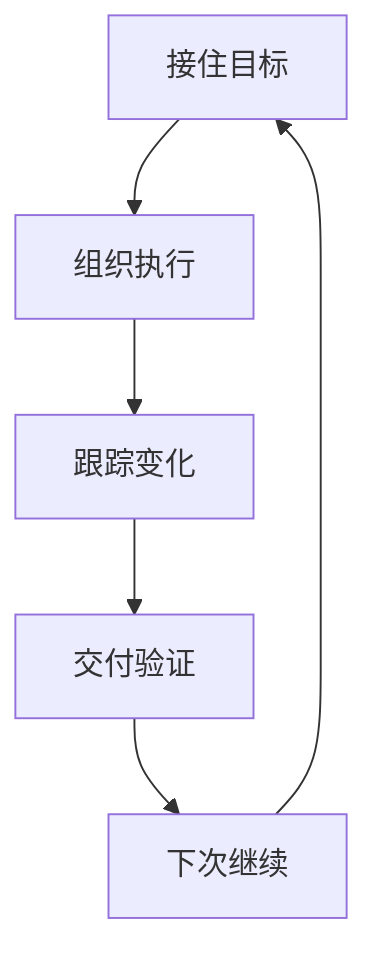
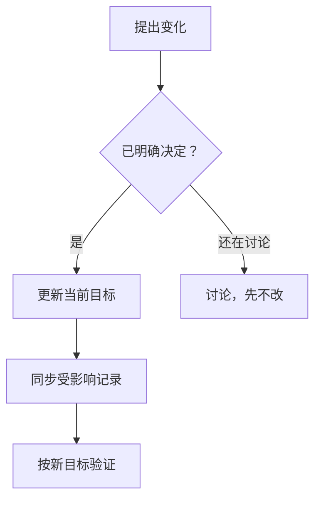
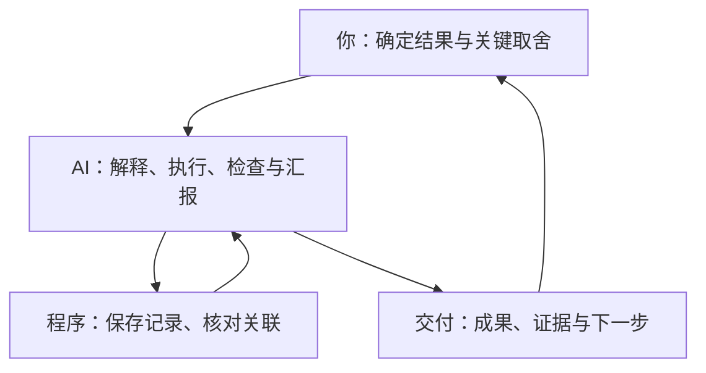

# DZ · Irixi Project Forge

**和 AI 一起把项目做成，并随时知道：现在能用什么、还缺什么、下一步做什么。**

DZ 面向非技术产品经理、个人开发者和项目负责人。它把目标确认、实际执行、变化处理、结果检查和下次接续串起来，帮助你参与关键决定，也让 AI 在已授权的范围内承担查资料、写代码、修问题和保存进展的工作。

它由一套可加载的工作规则和本地记录工具组成。能否直接开发、测试或上线，取决于你使用的 AI 平台实际提供的工具。

[快速开始](#快速开始) · [五阶段](#五阶段怎么推进) · [改目标](#中途改主意怎样处理) · [能力边界](#哪些有程序支持哪些依赖-ai-遵守规则) · [更新与回退](#更新备份与回退) · [English](#english)

工作流版本：`2026-10-03.1` · 插件版本：`1.0.12` · 项目记录格式：`1.1`

> 这份更新目前在[草稿 PR #1](https://github.com/Irixil/irixi-project-forge/pull/1)中，尚未合并到 `main`。下方快速开始使用该工作分支；从 `main` 下载时，请核对 `dz-manifest.json` 中的实际版本。

## 一个具体场景

下面用“小店留言整理工具”说明 DZ 的工作方式。

**常见的问题：** 你原本要做每月汇总，中途明确改成每天。AI 回答“好的”，却仍按旧计划做；输入检查通过了，就说工具已经完成。隔天换个对话，又不知道哪些结果是真的能用。

**按 DZ 推进：** 先把“每天能拿到可用的留言汇总”写清楚。你改目标后，AI 更新计划、待办和检查标准，保留仍适用的留言样本与代码。交付时让它从输入到保存结果实际跑一遍；只测过输入，就明确说“输入已检查，汇总和保存还没证明”。暂停前留下当前目标、可用成果、缺口和下一步。

你不需要学习内部记录格式。你负责选择想要的结果，AI 负责解释影响、执行和拿出证据。

## 五阶段怎么推进



| 阶段 | 你能看见的结果 |
|---|---|
| 接住目标 | 用途、交付物和怎样算完成；只讨论真正影响结果的缺口 |
| 组织执行 | 最小可行路线、缺少的输入、先做哪一步；已授权的小修由 AI 推进 |
| 跟踪变化 | 新决定同步到计划和任务，旧路线退出当前执行；有用成果不白做 |
| 交付验证 | 实际可用的东西、可复查的结果、失败和未测部分分别说明 |
| 下次继续 | 最新目标、已确认成果、遗留问题和下一步，便于休息后或换对话接着做 |

这五阶段贯穿同一个项目，可以根据反馈返回前面。简单任务不强制多个 Agent，也不要求填满整套模板。已确认范围内的缺陷修复不重新开展一轮产品访谈；不需要长期接续的独立小任务，也不必因为有一个文件夹就创建项目记录。

## 中途改主意，怎样处理

两句话会走不同路线：

- **“改成每天汇总，其他不变。”** 这是明确决定，更新受影响的目标、计划、任务、材料用途和验收，不让你再批准同一句话。
- **“要不要改成每天？”** 这是讨论，先解释取舍，当前目标不会因此自动替换。



旧文件留作历史，不再指挥当前工作。材料会按实际用途判断：独立可靠的事实可以继续用；依赖旧受众、旧数据或旧环境的材料需要复核；旧目标专属的建议与结论退出当前路线。保留代码不等于它已满足新目标，旧测试也不会直接成为新版本的通过证据。

如果在并行做事，AI 需要把新决定同步给受影响的工作者，并确认状态，再整合结果。迟到的旧目标输出可以保留其中仍可信的事实或代码，不能直接算成新目标验收。平台没有通知或查询工作者的能力时，这一缺口要说清楚。

写入失败时，应报告“目标已明确，但记录还没同步成功”，并保存能留下的交接信息；不能继续执行刚被你否定的旧路线。改目标也不会自动获得花钱、对外发送或发布的权限。

## 修不好时，怎样停下来再推进

DZ 要求 AI 在低风险、已授权的范围内自主修复，同时为重复尝试设置时间、成本、次数和无进展条件。已有约定优先；没有约定时，本地修复的一轮默认最多 15 分钟、不新增付费外部调用、对同一失败最多尝试三次，连续两次没有新证据或进展就停下那个循环。

停下时留下尝试过什么、发生了什么、缺少什么，以及哪种新输入或新思路能继续。独立且安全的其他工作可以推进；不能靠改任务名字或换一个 Agent 重新无限重试。程序支持记录这种停止原因，但不会自动计时、计数或取消进程。

记录不一致、文件变了或授权过期时，本地工具仍可提供只读诊断。能解释现状不代表旧授权恢复，也不代表已经自动修好。需要恢复记录时保留历史、处理受影响部分；需要取消外部任务时，只按真实工具结果报告是否停下。

## 谁负责什么



你不必替 AI 选择技术框架，也不必亲自测试才能暂停或结束。AI 应先用现有授权完成可检查的准备工作；只把真正影响用途、范围、信息去向、成本或权限的选择交给你。

有用的汇报应像这样：

> 现在能输入并保存留言，空内容会有提醒。每天汇总还没跑通，缺一组代表性样本。我建议先用已有的打码样本把整条流程测完；如果样本不代表你的实际留言，需要你补充一例。

## 怎样判断交付完成

完成标准来自当前已确认的目标。DZ 要求把承诺的用户操作实际跑到结果，再给出能复查的证据。

- **已通过：** 说明测了哪个当前版本、怎样操作、看到了什么，证据在哪里。
- **失败：** 保留失败结果，指出影响哪部分，并说明下一步。
- **未验证：** 条件不足、没有运行或只做了模拟检查时，明确留下缺口。

构建成功、页面能打开、待办全打勾，都不能单独证明主流程可用。局部检查通过而整条流程失败时，整体仍不能报通过。需要真实模型或真实浏览器路径的产品，模拟结果不能替代相应试用；同一个问题重开后也要取得本次修复后的证据。

你可以随时暂停或收尾。项目可以处于“已有部分成果，但还没验证完整”的状态，而不是为了结束对话把结果改成通过。

## 下次继续，或换一个平台

有项目文件和运行工具时，DZ 使用同一套项目记录保存当前状态和历史，并生成你能看懂的现状页。重新接管时先对照现有文件、最新明确决定和已保存结果，说明差异；保存的“下一步”只是旧建议。

一份可续接的交接信息包含：

1. 当前目标和完成标准。
2. 已确认的可用成果及证据位置。
3. 遗留问题、未测部分和待决定事项。
4. 推荐下一步、原因和继续所需条件。
5. 需要复核的材料，以及还在运行或尚未同步的任务。

普通聊天只能把这些信息导出，下一次需要你带上；DZ 不会凭提示词获得永久记忆。换模型或平台时，目标、记录、成果与验收资料可以迁移，但还要处理文件访问、工具、权限和环境差异，必要时重新检查。不保证随意换平台零成本。

## 快速开始

### 用 Codex 安装当前更新

准备 Git、Python 3，以及可读取项目和运行本地命令的 Codex。当前更新尚在草稿分支：

```sh
git clone --branch codex/dz-personal-workflow-2026-10-03 https://github.com/Irixil/irixi-project-forge.git dz
cd dz
python3 scripts/install_local_skill.py
```

安装器默认生成 `~/.agents/skills/dz`，只保留一个技能入口。如果已有受管理的安装或旧软链接，先按下方“更新、备份与回退”操作。不要把整个仓库软链接进去，也不要只复制 `skills/dz/` 内层目录。

重启宿主，在允许使用 DZ 的具体项目文件夹中开启新任务，通过技能菜单选择 `dz` 或调用 `$dz`：

```text
$dz 帮我做一个本地留言整理工具。
用途是每天整理小店留言；交付一个能输入、汇总并保存结果的工具。
完成标准是用代表性打码样本从头跑通，并说明失败和未测部分。
先用最小可行方式推进，只有缺少关键决定才问我。
```

续接已有项目：

```text
$dz 按最新确认目标接着做。先对照当前文件，告诉我可用成果、缺口和下一步。
```

如果菜单没有 DZ，但 AI 能读文件，要求它完整读取 `<已安装的 DZ 文件夹>/SKILL.md`，再处理项目。下载不等于已加载；不同宿主不一定识别 `$dz` 这几个字。原有项目明确暂停 DZ 时保留其规则，不因全局更新而自动启用。

### 其他 AI 平台

| 实际能力 | 加载与使用方式 |
|---|---|
| 支持 Agent Skills | 导入完整技能包，并用该平台的真实技能选择器调用 |
| 能读文件，不能安装 Skill | 提供完整 DZ 文件夹，要求先读根目录 `SKILL.md` |
| 支持项目或系统指令 | 放入 `portable/DZ-UNIVERSAL.md` 全文，并提供真实工具与记录 |
| 只有普通聊天或文件上传 | 提供通用版全文，用 `DZ启动：` 开始；以讨论和导出交接为主 |

同一套规则按实际工具调整执行方式，不按模型品牌承诺能力。完整加载步骤见 [GETTING-STARTED.md](GETTING-STARTED.md)。试用本次更新时，保留上面下载的草稿分支；指南中的 `main` 下载入口用于主分支版本，不要重新下载它来覆盖本次更新。本仓库含插件包装和可选的 Codex 收尾检查；独立 Skill 安装不要求启用 Hook，也不承诺 Marketplace 一键安装。需要时参阅 [Codex 接入](references/codex-native.md)和 [Hook 说明](references/codex-stop-hook.md)。

## 更新、备份与回退

更新前记下当前源码提交，并保留旧版完整文件夹和项目记录。不要覆盖尚未保存的源码改动。取得准备使用的新版本后，在它的文件夹中运行：

```sh
python3 scripts/install_local_skill.py --replace
```

安装器会把原受管理安装或旧软链接移到 `~/.agents/skill-backups/`，输出具体备份位置，再安装新副本。没有受管理标记的普通目录会被拒绝替换。保存的软链接只是链接，不能代替旧源码快照。只重启宿主不会更新已安装文件；重新安装后再重启并开新任务。

要恢复旧 Skill，可以从已保留的旧版完整目录运行它的安装器：

```sh
python3 "<旧版完整目录>/scripts/install_local_skill.py" --replace
```

这会恢复技能版本，并再次备份被替换的安装；它不会自动撤销项目代码、用户后来作出的决定或项目记录变更。旧工具不保证能读新版记录，恢复前保留记录副本并检查兼容性，不能为了让旧工具通过就删掉新字段或证据。

旧项目不会批量迁移。重新进入项目时按现行规则核对，再在授权范围内更新指引；更早的 `1.0` 记录需使用工具的迁移入口，保留旧记录，无法证明的结论如实降为未验证。技术操作见 [项目记录说明](references/project-state.md)。

## 哪些有程序支持，哪些依赖 AI 遵守规则

| 部分 | 当前边界 |
|---|---|
| 本地记录工具 | 可检查记录一致性、需求与任务覆盖、证据关联和文件变化，生成只读接续诊断 |
| 工作规则 | 规定怎样理解最新决定、评估材料、有限尝试、同步工作者和汇报；需要 AI 正确遵守 |
| 宿主工具与权限 | 决定是否能读写文件、运行程序、发出通知或执行外部操作；DZ 不会凭空增加这些能力 |

本地程序已通过合成回归和安装检查，包括目标变更、旧证据拒绝、只读诊断、有限尝试停止的记录，以及搬迁记录后保持暂停状态。这证明被测程序路径的行为，不证明真实业务应用已经可用，也不能为 AI 自己写的批准或测试声明提供不可伪造的认证。

本版还进行了 **4 个真实 Codex CLI 新会话**，使用账户当时提供的 `gpt-6-astra`，输入为本机合成项目：

| 实际试用 | 观察到的结果 |
|---|---|
| 明确从每月改成每天 | 同步目标、需求、计划、待办和下一步；保留事实与历史；按要求保持暂停 |
| “要不要改成每天” | 解释取舍；项目文件集合和内容哈希不变 |
| 输入通过、保存故障 | 实际主流程失败，整体未通过；探测 1 次无新线索后停止，保存阻塞和恢复条件 |
| 新会话休息后续接 | 读取每日新目标，说明尚无可用应用及未测部分；文件集合和内容哈希不变 |

另有 **2 个实际并行工作者** 在 Codex 宿主中读取同一项目。目标变化后，它们重读新版本、复核材料和建议，旧月度草案保留为历史。协调消息在 90 秒等待超时后才到达，后续已确认接收与版本一致；该项依据协调者收到的宿主消息与产物记录，未另行导出工作者逐工具事件供独立审查。这不是即时自动同步的证明。试用只检查材料与建议的协作，没有让两个工作者共同修改产品代码。

第二平台 Claude Code 的实际请求遇到 401 认证失败，停止后记为**环境阻塞**，没有完成模型行为试用，因此不算跨平台通过。本轮未进行真人使用试验、生产部署或长期运行验证。具体输入下的成功不保证每个模型都遵守规则，也不支持“永不跑偏”“所有平台原生兼容”或“全天自动监督”。历史试用保留各自版本和日期，不自动成为本版验证。

验证范围与复跑方法见 [本版验证说明](tests/personal-workflow-2026-10-03.md)；自动检查配置见 [Validate DZ](.github/workflows/validate.yml)。文中的三张图使用 [GitHub 支持的 Mermaid 格式](https://docs.github.com/en/get-started/writing-on-github/working-with-advanced-formatting/creating-diagrams)，无需外部图片服务或追踪资源。

## 文件导航

| 想了解什么 | 从这里开始 |
|---|---|
| 实际工作规则 | [SKILL.md](SKILL.md) |
| 安装、加载与平台入口 | [GETTING-STARTED.md](GETTING-STARTED.md) |
| 普通聊天可用的通用版 | [DZ-UNIVERSAL.md](portable/DZ-UNIVERSAL.md) |
| 中途接管与续接 | [接续说明](references/takeover-resume.md) |
| 本地记录与恢复命令 | [项目记录](references/project-state.md) |
| 模型与平台适配边界 | [平台适配](references/platform-adapters.md) |

根目录 `SKILL.md` 是维护入口，插件内层入口转发它，通用版由脚本生成。功能规则在那里维护；README 负责解释如何使用。

## English

**DZ helps nontechnical product managers, individual builders and project owners work with AI toward a useful result—and understand what works, what is missing and what to do next.**

Its five-stage personal workflow is: understand the goal, organize execution, track changes, verify delivery, and resume next time. A definite goal change updates the affected plan, tasks, materials and checks; exploratory discussion does not silently replace the current goal. Compatible facts and code can survive a change, while old instructions and proof do not become current acceptance automatically.

DZ consists of agent instructions plus a local record tool. The agent handles judgment, execution, bounded repair and communication; the tool checks recorded relationships and integrity. Actual file access, execution, permissions and external actions come from the host. Multiple agents are optional, and simple work need not initialize a continuity ledger.

For repeated local repair, existing agreed bounds take priority. Without them, the default slice is 15 minutes, no new paid external calls, at most three attempts at one failure, and a stop after two attempts without new evidence or progress. The tool records that stop; it does not time effort, count retries or cancel processes. Delivery requires evidence for the current promised user flow, with passed, failed and unverified results kept separate.

### Install and start

This README describes workflow `2026-10-03.1`, plugin `1.0.12` and record format `1.1`. The update is on [draft PR #1](https://github.com/Irixil/irixi-project-forge/pull/1), not yet on `main`. To try that branch:

```sh
git clone --branch codex/dz-personal-workflow-2026-10-03 https://github.com/Irixil/irixi-project-forge.git dz
cd dz
python3 scripts/install_local_skill.py
```

Restart the host, open the authorized project folder, then select the installed Skill or invoke `$dz` where the host supports it. Supply the purpose, deliverable and observable completion standard. On a file-capable host without Skill discovery, ask it to read the installed `SKILL.md` completely. A chat-only host can load `portable/DZ-UNIVERSAL.md`, discuss decisions and export a handoff; it cannot pretend to build or test.

### Update, recover and transfer

Keep the previous complete version and project records before updating. Run `python3 scripts/install_local_skill.py --replace` from the new version; the installer backs up a managed installation or symlink, and refuses an unmanaged directory. A symlink backup is not an immutable source snapshot. Reinstalling from a retained complete previous version restores the Skill, not later project changes. Older tools may reject newer records; preserve them and check compatibility.

A resumable handoff keeps the latest goal, usable outcomes, evidence, unresolved issues and next step. Moving to another model or platform may require tool, permission, file and environment reconciliation or fresh checks; it is not guaranteed to be free or automatic.

### Evidence and limits

Synthetic program regressions and installation checks passed. Four fresh Codex CLI sessions using the account-available `gpt-6-astra` exercised explicit goal change, unchanged exploratory discussion, a real local main-flow failure with bounded diagnosis, and read-only resumption. Two live host workers reread a changed contract and delivered isolated material reviews and suggestions; coordinator messages arrived after the initial 90-second wait. This account uses coordinator-observed host messages and worker outputs, without separately exported worker tool traces for independent review; it does not prove instantaneous automatic synchronization or concurrent product-code editing.

A Claude Code request failed with HTTP 401 and was stopped; it is an environment blocker, not a passed second-platform trial. No human usability, production or long-term trial was run. These bounded observations do not guarantee universal agent compliance, permanent memory or continuous supervision. See the [validation scope](tests/personal-workflow-2026-10-03.md), [loading guide](GETTING-STARTED.md) and [platform boundaries](references/platform-adapters.md). For this draft update, keep the branch cloned above; the loading guide’s `main` download links select the main-branch version, not this update.

## 许可 / License

采用 **PolyForm Perimeter License 1.0.1**，具体使用、修改和分发条件以 [LICENSE.md](LICENSE.md) 为准。

Licensed under **PolyForm Perimeter License 1.0.1**. See [LICENSE.md](LICENSE.md) for the governing terms.

Required Notice: Original project: Irixi Project Forge — https://github.com/Irixil/irixi-project-forge
